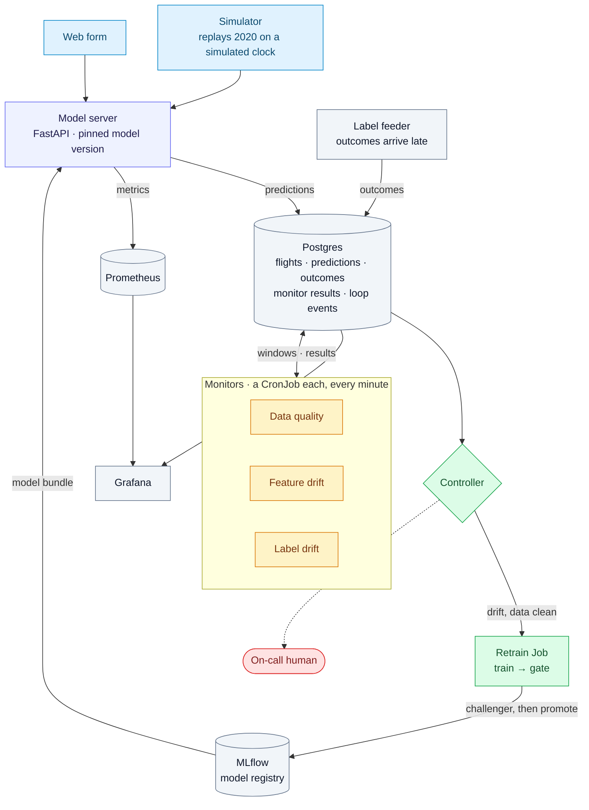

# DriftOps

**A model that notices it has gone stale, decides whether retraining is safe, retrains, proves the
new model is better, and rolls it out, on Kubernetes.**

A flight-disruption model (will this US flight arrive 15+ minutes late, be cancelled or be
diverted?) trained on 2018 and replayed through 2019 and the COVID collapse of 2020, where the
drift dates are known, so every part of the loop can be measured.

**[Architecture](docs/ARCHITECTURE.md) · [Spec](docs/SPEC.md) · [Roadmap](docs/ROADMAP.md) ·
[Research](docs/research/) · [Decisions](docs/decisions/)**

> 🚧 **Status:** research done; building the system (Phase 1: serving on k3d).

## What the research found

Before building anything, the loop was tested offline on 18 months of real flights.

**Watching inputs missed COVID for six weeks.** Airlines kept their schedules in March 2020 and
cancelled flights on the day: features barely moved while the disrupted rate went from 12% to
53%. Label monitoring caught it on **March 27**, feature monitoring only on **April 10**. The
loop acts on either. → [Detection study](docs/research/01-detection-study.md)


**The gate can't protect you from bad data.** Two of three pipeline bugs (miles sent as km, a
renamed carrier code) look exactly like drift. With the data-quality guard off, the loop retrained
on the corrupted data and **the gate passed it**: both models were judged on the same corrupted
week. The guard, not the gate, is the defence.

**Drift-triggered retraining beat never retraining and retraining on a schedule**, mostly by
doing nothing in calm months and reacting within days in the shock:

| Policy | Retrains | 2019 (calm) | 2020 Mar–Apr (shock) | 18 months |
|---|---|---|---|---|
| never retrain | 0 | 0.1603 | 0.2446 | 0.1640 |
| monthly, no gate | 18 | 0.1693 | 0.2474 | 0.1711 |
| monthly, 52-week window, gated | 18 | 0.1603 | 0.2394 | 0.1629 |
| **DriftOps** | **11** | **0.1603** | **0.2303** | **0.1617** |

Brier score, lower is better. → [Retrain-policy backtest](docs/research/02-retrain-policy-backtest.md)

## The system



One image, one Helm chart, k3d locally, 30-minute AKS sessions on demand. The controller and the
gate are the same code the backtest ran. → [Architecture](docs/ARCHITECTURE.md) (the controller's
decision and one retrain step by step)

## Run it

```bash
uv sync
uv run python -m driftops.data 2018-01 2020-06        # BTS → data/parquet (162 MB)
uv run pytest                                          # unit tests
```

Research reproduction commands are in each research doc. The cluster (`make up`) arrives with
Phase 1.
