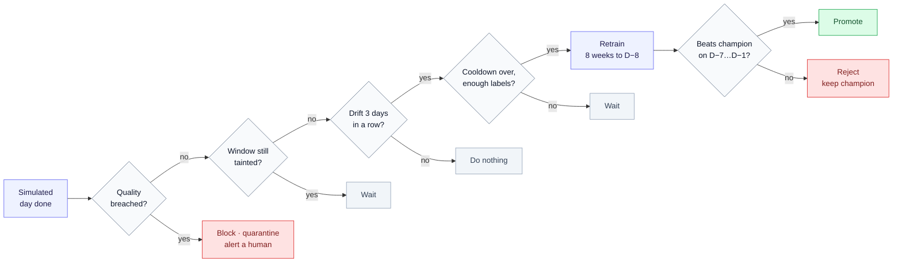
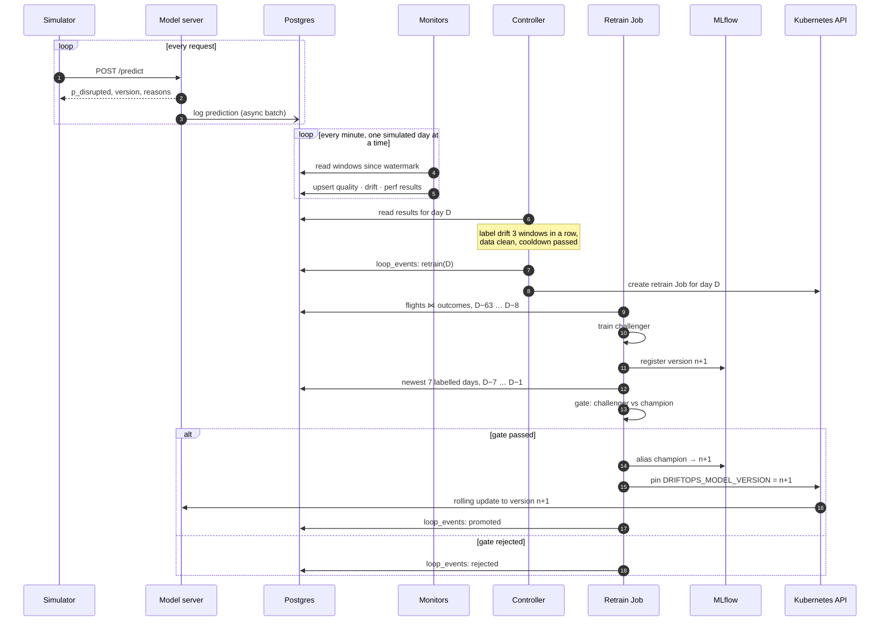

# DriftOps: Architecture

> **How it's shaped.** Components, what runs when, and why. Numbers come from the research
> ([detection study](research/01-detection-study.md),
> [retrain-policy backtest](research/02-retrain-policy-backtest.md)). Anything not built yet is
> marked with its phase.

## 1. The loop

The system diagram is in the [README](../README.md#the-system); this section says what each
phase adds to it.

| Phase | Adds |
|---|---|
| 1 | simulator, model server, prediction logging, Postgres, MLflow, seed |
| 2 | label feeder, the three monitors, Prometheus, Grafana, Loki, alerts |
| 3 | controller, retrain Job with the gate, promotion |
| 4 | Argo Rollouts canary with automatic rollback |
| 6 | the same chart on AKS, 30-minute sessions |
| 7 | API keys, OIDC, rate limits, NetworkPolicies, operator API |
| 8 | load tests, KEDA, the measured capacity and cost model |

## 2. Two signals and a guard (the research result the design rests on)

| Signal | Needs labels? | Sees | March 2020 | False alarms, 2019 |
|---|---|---|---|---|
| **Feature drift**: PSI per feature, 7-day window | no | the inputs changing (schedule cuts, hub shifts) | fired 2020-04-10 | 0 |
| **Label drift**: calibration gap and Brier, 7-day window | yes | the relationship changing (same flights, different outcomes) | fired **2020-03-27**, 14 days earlier | 0 |

In March 2020 airlines kept their schedules and cancelled flights on the day: inputs barely
moved while the disrupted rate went from 12% to 53%. Watching features alone, the system would
have been blind for six weeks. So the controller acts on **either** signal.

**The guard comes first.** A miles→km unit bug and a renamed carrier code both trip the feature
drift alarm (PSI 0.35 and 1.82). The backtest shows what happens without the guard: the loop
retrains on the corrupted data, **the gate passes it** (it judges both models on the same
corrupted week), and the next 8 weeks are 8% worse than never retraining.

| Corruption | Drift alarm | Caught by |
|---|---|---|
| distance sent in km | yes | route-distance mismatch 97.5% |
| schedule lookup times out, 30% nulls | no | null increase +31% |
| carrier `AA` arrives as `AAL` | yes | unseen category 13% |

Prediction-score PSI against a full-year reference swings to 0.38 with seasonality alone, so it
is charted, never alarmed on.

## 3. Components

### Long-running

| Component | Does | Phase |
|---|---|---|
| **model server** | `POST /predict`. Builds the feature row (filling schedule features from `flights`), scores with the pinned model version, returns SHAP reasons. Logs to an in-process bounded queue that a background task flushes to Postgres in batches; a full queue drops and counts, it never blocks a request | 1 |
| **simulator** | Walks a scenario day by day: a 5% hash sample of that day's flights (~1,000) in departure order, at a set wall-clock pace, advancing `sim_clock`. Corruption transforms rewrite the payload, as a broken upstream pipeline would | 1 |
| **Postgres** | One instance (StatefulSet). Per-request rows need the predictions ⋈ outcomes join and per-slice queries: relational, not a time-series DB (ADR-0006) | 1 |
| **MLflow** | Tracking + registry, backed by Postgres; serves artifacts from a volume (ADR-0012). A model version is a bundle: LightGBM booster, category vocabulary, drift reference, metadata | 1 |
| **label feeder** | Copies outcomes whose `known_at` ≤ simulated now from `outcomes_feed` to `outcomes` | 2 |
| **Prometheus, Grafana** | upstream charts | 2 |
| **Argo Rollouts** | canary 20 → 50 → 100% | 4 |

### Scheduled and on-demand

Every window is in **event time**. Each run reads its watermark and processes **every simulated
day completed since, one day at a time**, so resolution never depends on the schedule: at 10 s
per simulated day a 1-minute CronJob sees six new days per run and writes six rows. CronJobs run
with `concurrencyPolicy: Forbid` and upsert one row per (monitor, window end, model version), so a
retried run never double-counts and a clock jump needs no special case (ADR-0010).

Decisions are anchored to the **day they evaluated**, not to the wall clock: a retrain decided for
day D trains on data ending D−8 and gates on D−7…D−1, exactly as in the backtest. Only the
promotion lands later in simulated time (a CronJob tick plus the Job's ~30 s), which is a demo
pacing artefact, measured and reported, not hidden.

| Job | Every | Writes | Alarm when | Phase |
|---|---|---|---|---|
| **monitor quality** | 1 min | null increase, out-of-range, unseen categories, route-distance mismatch | any above its limit | 2 |
| **monitor drift** | 1 min | PSI per non-calendar feature; prediction PSI (charted only) | max feature PSI > 0.10 | 2 |
| **monitor perf** | 1 min | calibration gap, Brier, AUC, overall and per slice | abs(gap) > 0.158 or Brier > 0.326 | 2 |
| **control** | 1 min | decisions → `loop_events`; creates the retrain Job | see policy | 3 |
| **retrain** (Job) | on demand | challenger + gate result → MLflow, `loop_events`; on pass, the new pinned version | — | 3 |

**Policy** (`driftops/policy.py`, unchanged from the backtest): K = 3 alarm windows in a row, a
7-day cooldown, at least 50k labelled rows.

**One retrain, in order** (Phase 3):

**Retrain:** LightGBM on the 8 weeks of labelled flights ending 8 days before the decision,
quarantined days removed (~20–40 s). **Gate:** challenger vs. champion on the 7 newest labelled
days: lower Brier and AUC no more than 0.005 worse. Random holdouts are not used: same-day
weather leaks across a random split (AUC 0.75 vs. 0.60–0.68 out of time).

**Promotion** (Phase 3) changes the pinned model version in the server's spec, which rolls the
pods; Phase 4 replaces the rolling update with a canary. The canary can only check proxy metrics
(error rate, p95, positive-prediction rate) because labels take hours; perf-monitor's later
verdict can roll the version back.

## 4. Dashboards (Phase 2)

| Dashboard | For | Panels |
|---|---|---|
| Service health | SRE | req/s, p50/p95/p99, errors, dropped logs, all by `model_version` |
| Data drift | ML engineer | per-feature PSI over time, prediction PSI, thresholds |
| Data quality | data engineer | the four quality rates and their limits |
| Model performance | data scientist | calibration gap, Brier, AUC by slice, label lag, champion vs. challenger |
| **The loop** | the demo | timeline: alarm → retrain → gate → promoted / rejected; blocked retrains; current version |

## 5. Demo pacing

COVID detection takes ~26 simulated days, then retrains come weekly. At 20 s per simulated day
that is 40 minutes, longer than a session. So the seed loads Jan 1 – Mar 9, 2020 as already-known
history (monitors and the first retrain have their windows on boot), and the COVID scenario
replays from Mar 10 at 10 s per simulated day: detection, retrains and the gate within ~8
minutes (ADR-0014). The corruption scenario is separate and shorter.

## 6. Environments

| | Where | How |
|---|---|---|
| local | k3d on the laptop | `make up`: cluster, image import, Helm install, seed |
| session (Phase 6) | one-node AKS, 30 minutes | InfraChat's split: a `core` layer applied once (resource group, identity, budget), a disposable `session` layer created by a workflow button, a sweeper for expired clusters |

## 7. Known limits

- **The model is modest** (AUC 0.60–0.68 out of time). The schedule can't see weather, which
  causes most delays. The loop is the subject; weather would be a measured addition.
- **COVID detection takes ~2 simulated weeks**, mostly the 7-day window and thresholds set above
  2019's worst storms. Shorter windows catch it sooner and false-alarm on storms.
- **A sliding window learns temporary regimes.** A model retrained in April 2020 is wrong when
  travel recovers; the loop retrains again, a human might prefer to hold.
- **A good schedule is a strong baseline.** Monthly retraining with a 52-week window and the gate
  is 0.7% behind the policy over 18 months; the policy's edge is speed in a shock and doing
  nothing in calm months.
- **Single Postgres, single MLflow.** Fine for one model; the predictions table would move to
  object storage plus a query engine long before Postgres became the limit.
