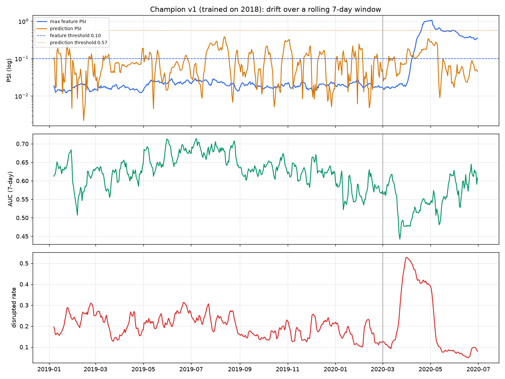
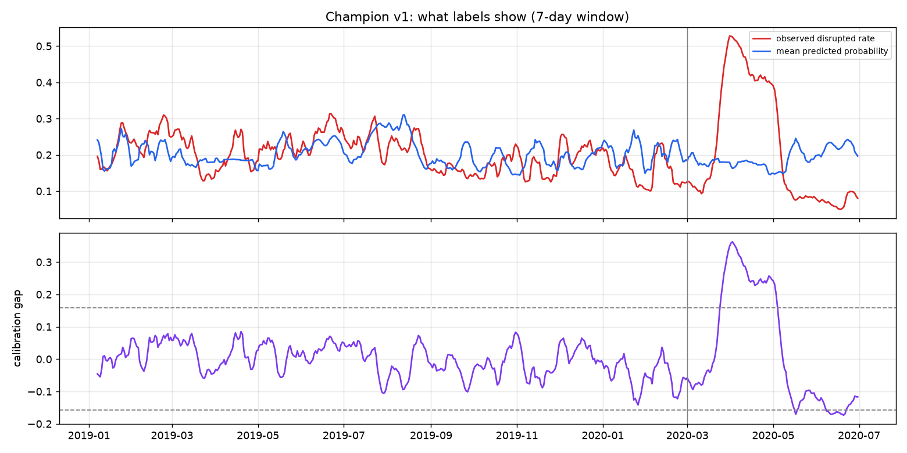

# Research 01: Detection study

> **Question:** on this data, is drift detectable, and quiet when it should be?
> **Answer:** yes, but only if you watch outcomes as well as inputs, and only if a data-quality
> check stands in front of the drift alarm.

Script: [`scripts/research/detection_study.py`](../../scripts/research/detection_study.py),
[`detection_labels.py`](../../scripts/research/detection_labels.py) ·
Numbers: [`reports/detection-study/`](../../reports/detection-study/)

## Setup

- **Data:** BTS on-time performance, 2018-01 → 2020-06. Rows per month: ~570k–660k through
  February 2020, then 648k scheduled in March, 313k in April, 181k in May.
- **Champion v1:** LightGBM on 6.8M flights from 2018, **97 s on 2 threads** (what one AKS node
  gives a Job). Holdout AUC 0.75 on a random 2018 split; **0.60–0.68 month by month on 2019**.
- **Replay:** every day from 2019-01-07 to 2020-06-30, trailing 7-day window, a 5% sample of
  flights (~1,000 a day): what the monitors will see in the cluster.
- **Reference:** a 50k-row sample of the training data.
- **Thresholds:** max(rule of thumb, 1.5 × the worst value in the 2019 control year): feature PSI
  0.10, abs(calibration gap) 0.158, Brier 0.326 (ADR-0004).

## Results

| Question | Result |
|---|---|
| Does the 2019 control year stay quiet? | **0 alarm days**, feature and label monitoring alike |
| When does **feature** drift catch COVID? | **2020-04-10**, 40 days after March 1 (`origin_hour_load`, when schedules were finally cut) |
| When does **label** drift catch COVID? | **2020-03-27**, 14 days earlier (disrupted rate 12% → 53%, model still saying ~18%) |
| Gradual drift (hub flights gain weight per day) | 10%/day: 2 days · 5%: 2 · 2%: 37 · 1%: 75 · 0.5%: 182 |
| Do pipeline bugs look like drift? | **2 of 3 trip the drift alarm**; data quality catches all 3 |

| Corruption (2 weeks from 2019-09-01) | Drift alarm | Data quality |
|---|---|---|
| distance sent in km | yes, PSI 0.35 | route-distance mismatch 97.5% |
| schedule lookup times out (30% nulls) | no | null increase +31% |
| carrier `AA` arrives as `AAL` | yes, PSI 1.82 | unseen category 13% |





## What it means

1. **Watching inputs is not enough.** In March 2020 the airlines kept their schedules and
   cancelled flights on the day. Inputs barely moved; outcomes did. A feature-only monitor was
   blind for six weeks. → ADR-0005: retrain on feature **or** label drift.
2. **The data-quality check comes first.** Two of three pipeline bugs are indistinguishable from
   drift by PSI. → the guard.
3. **A random holdout lies.** 0.75 AUC on a random split vs. 0.60–0.68 on the next year: same-day
   weather leaks across the split. → the gate compares on out-of-time days only.
4. **Prediction-score drift is seasonal by construction.** It reached 0.38 PSI in 2019 with no
   real change. → charted, never alarmed on.
5. **After the shock the error flips sign.** From May 2020 empty skies make flights *more*
   punctual than the model expects (gap −0.17). A model retrained in April learns a regime that
   is about to end.

## Checks on the method

- **The quiet 2019 is not an artifact of calibrating on 2019.** Thresholds calibrated on
  January–June 2019 alone give 0 alarms in July–December and catch COVID on 2020-03-26. In
  January–February 2020 they fire on 2 single days, which K=3 consecutive windows absorbs.
- **p-values would have alarmed constantly.** At ~7,000 rows a window, a KS test calls a
  0.02-sigma shift significant ([pulsar-metrics findings](../findings/pulsar-metrics.md), B2).

## Reproduce

```bash
uv sync
uv run python -m driftops.data 2018-01 2020-06          # BTS → data/parquet (162 MB)
uv run python scripts/research/detection_study.py       # ~10 min
uv run python scripts/research/detection_labels.py      # ~3 min
```
