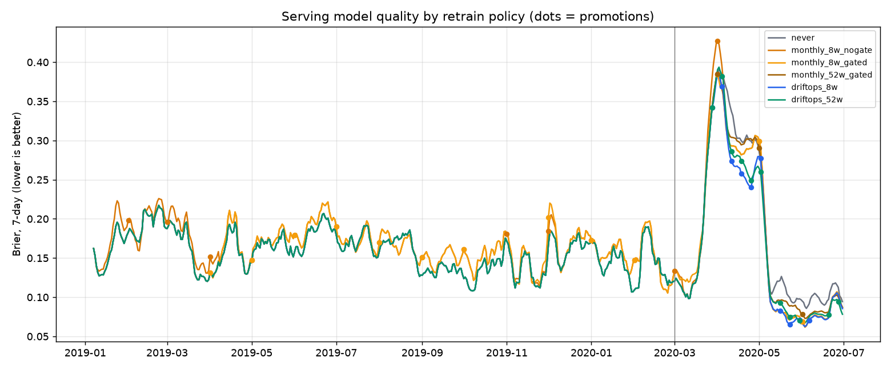
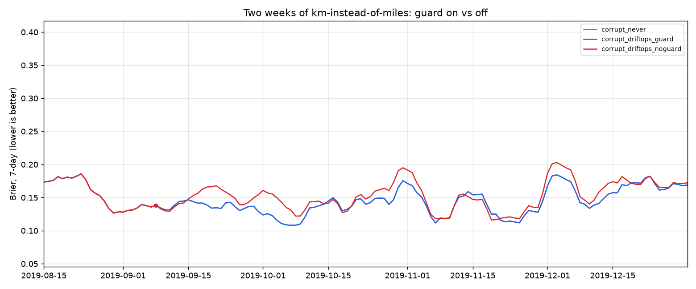

# Research 02: Retrain-policy backtest

> **Question:** detection works; does the whole loop pay off? Does retraining when the
> controller says so beat never retraining, and beat retraining on a schedule?
> **Answer:** yes, modestly on average and clearly where it matters: it does nothing in the calm
> year, reacts within days in the shock, and the guard prevents the one failure the gate can't.

Script: [`scripts/research/policy_backtest.py`](../../scripts/research/policy_backtest.py) ·
Numbers: [`reports/policy-backtest/`](../../reports/policy-backtest/)

## Setup

A day-by-day replay of 2019-01-01 → 2020-06-30 that plays the whole cluster, using the **same
`driftops/policy.py` and `driftops/model.py` the cluster runs**:

1. The serving model scores the day's flights.
2. End of day: monitors read the trailing windows (features through today, labels through
   yesterday) from the 5% traffic sample.
3. The policy decides. A retrain trains on the labelled history ending 8 days back (quarantined
   days removed), the gate compares challenger and champion on the newest 7 labelled days.
4. A promoted model serves from the next day.

Outcomes come from a feed covering **every** flight, so training data never depends on which
requests happened to arrive. Quality is scored on every flight. **Brier, lower is better.**

## Results

| Policy | Retrains (promoted) | 2019 control | 2020 Mar–Apr shock | 2020 May–Jun | 18 months |
|---|---|---|---|---|---|
| never retrain | 0 | 0.1603 | 0.2446 | 0.1067 | 0.1640 |
| monthly, 8 weeks, no gate | 18 (18) | 0.1693 | 0.2474 | 0.0869 | 0.1711 |
| monthly, 8 weeks, gated | 18 (13) | 0.1670 | 0.2420 | 0.0869 | 0.1689 |
| monthly, 52 weeks decayed, gated | 18 (3) | 0.1603 | 0.2394 | 0.0933 | 0.1629 |
| **DriftOps, 8 weeks** | **11 (10)** | **0.1603** | **0.2303** | **0.0853** | **0.1617** |
| DriftOps, 52 weeks decayed | 14 (11) | 0.1603 | 0.2339 | 0.0875 | 0.1621 |



| km instead of miles for 2 weeks | What happened | Brier, corruption + 8 weeks |
|---|---|---|
| never retrain | — | 0.1371 |
| DriftOps, guard on | 20 days blocked and quarantined, no retrain | **0.1371** |
| DriftOps, guard off | retrained on corrupt data, **the gate passed it** | 0.1480 (+8%) |



## What it means

1. **It acts where it should and stays out of the way where it should.** 0 retrains in 2019;
   first retrain 2020-03-28. Against never retraining: Brier −5.8% in the shock and −20% in
   May–June; mean daily AUC 0.558 vs. 0.533 and 0.629 vs. 0.566.
2. **Retraining on a schedule made the calm year worse.** Two months of data can't learn what a
   full year of seasons taught v1. The gate halves the damage but can't remove it: a model that
   wins one week can lose the next month.
3. **A well-built schedule is a strong baseline.** Monthly + 52-week window + gate is only 0.7%
   behind over 18 months. The policy's edge is reacting within days and costing nothing in calm
   months, not a large average gain.
4. **The gate can't protect you from bad data; only the guard can.** With the guard off the gate
   compared both models on the same corrupted week and passed the corrupted one.

## Limits

- Detection still takes ~4 weeks of simulated time on COVID, so the shock period improves but
  doesn't recover.
- One run per policy. The shock-period gap (0.2303 vs. 0.2446) is large next to day-to-day noise;
  the 18-month gap to the best schedule (0.1617 vs. 0.1629) is not, and isn't claimed as a win.
- Retrains use fixed boosting rounds (no early stopping), because the only data newer than the
  training window is the gate's.

## Reproduce

```bash
./scripts/research/policy_backtest_all.sh            # 9 runs, ~25 min on 8 cores
uv run python scripts/research/policy_report.py      # table + charts
```
